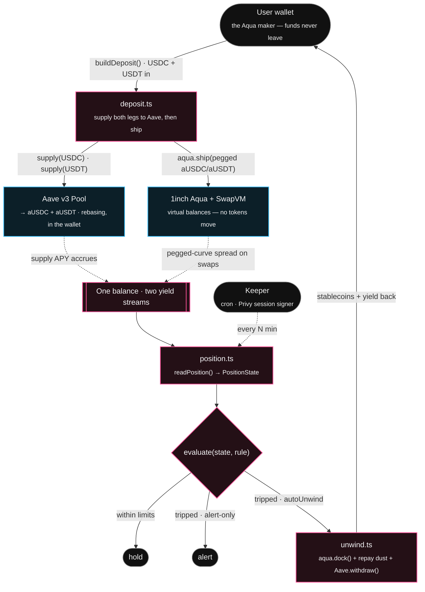

<p align="center">
  
</p>

# AquaStack

**Deposit USDC once. The same balance earns Aave lending yield *and* provides
1inch Aqua liquidity at the same time — with an automated rule that exits the
position when the peg breaks.**

In normal DeFi, a dollar does one job: it's lent on Aave, *or* it's LP'd on a
DEX. You pick. AquaStack runs both on a single balance, because 1inch Aqua makes
that possible.

---

## Live on Base Sepolia (chain 84532)

The full stack is deployed and exercised end-to-end on **real Base Sepolia** —
`npm run e2e:live` runs deposit → Aave supply → `ship` → taker swaps → `readPosition`
→ `buildUnwind` (dock + withdraw) → funds back, all on-chain.

| Contract | Address |
| --- | --- |
| Aqua registry (`AquaRouter`) | [`0x0771a4ca37e61993540ed939157635aa7d0f9584`](https://sepolia.basescan.org/address/0x0771a4ca37e61993540ed939157635aa7d0f9584) |
| `AquaSwapVMRouter` | [`0x693c469df6e60ba8bff5b9f4fba3455e4cd8dbf1`](https://sepolia.basescan.org/address/0x693c469df6e60ba8bff5b9f4fba3455e4cd8dbf1) |
| Aave v3 Pool | [`0x8bAB6d1b75f19e9eD9fCe8b9BD338844fF79aE27`](https://sepolia.basescan.org/address/0x8bAB6d1b75f19e9eD9fCe8b9BD338844fF79aE27) |
| USDC / aUSDC | `0xba50Cd2A20f6DA35D788639E581bca8d0B5d4D5f` / `0x10F1A9D11CDf50041f3f8cB7191CBE2f31750ACC` |
| USDT / aUSDT | `0x0a215D8ba66387DCA84B284D18c3B4ec3de6E54a` / `0xcE3CAae5Ed17A7AafCEEbc897DE843fA6CC0c018` |
| Aave faucet (open `mint`) | `0xD9145b5F45Ad4519c7ACcD6E0A4A82e83bB8A6Dc` |
| WETH (OP-stack predeploy) | `0x4200000000000000000000000000000000000006` |

Deployed by [`scripts/deploy-testnet.ts`](./scripts/deploy-testnet.ts) from the
opcode-matched `1inch/swap-vm@v1.0.2` + `1inch/aqua@main` vendored artifacts;
deployer [`0x236d7352170BDf28866A889D970A35A2FB267082`](https://sepolia.basescan.org/address/0x236d7352170BDf28866A889D970A35A2FB267082),
full record in [`deployments/84532.json`](./deployments/84532.json).

Sample live e2e transactions:
[`ship`](https://sepolia.basescan.org/tx/0x527570c2e7fe21ae9591211653124556a17d288ecf3ca5b17a6423b1791e0e42) ·
[taker `swap`](https://sepolia.basescan.org/tx/0xf3f32320aca9a2c047eae0403d1e04650ab1e6330a3b812d718912f017b33c48) ·
[`dock`](https://sepolia.basescan.org/tx/0x9c7e89d6edf69c27c966fb8eff4023476755d77b477d822615d78c218c3cbea7)
— maker shipped 1,500 USDC + 1,500 USDT, absorbed 2 taker swaps, then unwound:
**principal fully returned + a small Aqua spread**, aTokens zero, position `docked`.

---

## Why one balance can do two jobs

[1inch Aqua](https://1inch.com/aqua/) is a shared-liquidity layer. A maker
registers a *virtual* balance; the underlying tokens **never leave the maker's
wallet**. Aqua only moves them — via `pull()` / `push()` — at the instant a swap
actually settles against that maker.

That single property is the whole idea:

> The tokens sit in your wallet the entire time they're "providing liquidity."
> So they can be a **rebasing Aave aToken** — accruing supply interest in the
> wallet — *while* Aqua treats them as live liquidity. Aqua's virtual balance is
> a fixed number; the yield accrues on top and stays yours. Nothing is
> double-spent, because Aqua can only ever pull up to the virtual balance, and
> only during a real swap.

This is verified end-to-end on Base Sepolia (real Aave v3 + our redeployed Aqua)
— see [What's verified](#whats-verified).

---

## How it works



1. **Supply** — the user brings both legs (USDC + USDT on Base Sepolia); both are
   supplied to Aave v3, becoming `aUSDC` and `aUSDT`.
2. **Ship to Aqua** — both aTokens are registered as a pegged AMM strategy
   (`aUSDC/aUSDT`, a tight band around 1.0) with `aqua.ship()`. **No tokens
   move** — this is pure accounting.
3. **Earn on both sides** — each aToken keeps compounding Aave interest in the
   wallet; swaps routed through Aqua pay the position a spread.
4. **Protected exit** — a keeper evaluates the user's rule every few minutes and,
   when it triggers, calls `aqua.dock()` to release the position and (optionally)
   withdraws from Aave back to USDC.

### Walkthrough (`npm run e2e:testnet`, Base Sepolia fork)

| | |
| --- | --- |
| deposit | `5,000 USDC` + `5,000 USDT` → supplied to Aave, shipped to Aqua |
| after 2 taker swaps + 30 days | **real Aave yield +6.68 USDT**, Aqua spread on top |
| `evaluate()` | `hold` (+6.7 bps return, under the take-profit) |
| forced unwind | `dock()` + repay dust + 2 × `Aave.withdraw` — 4 txs |
| back in wallet | **`~4,996 USDC`** + the USDT leg + yield, fully liquid |

---

## The protective rule

Each position carries one `Rule`. Every threshold is optional; the first to fire
triggers an exit.

| field | meaning |
| --- | --- |
| `pegDeviationBps` | exit if the pool's live quote leaves ±this of 1:1 |
| `takeProfitBps` | exit once total return reaches +this (bps of principal) |
| `stopLossBps` | exit if total return drops to −this |
| `maxDrawdownBps` | exit if the drop from the best return seen exceeds this |
| `autoUnwind` | `true` → keeper unwinds; `false` → keeper only alerts |

`evaluate(PositionState, Rule)` is a pure function returning
`hold | alert | unwind`. Presets: `conservative`, `balanced`, `alertOnly`.

**What the rule does and doesn't do:** it exits *on a detected* depeg. By the
time the pool has visibly moved, arbitrage has already rotated it toward the weak
asset — the rule caps further bleeding, it does not prevent the loss already
priced in. The tagline is "auto-exits on depeg," not "protects before a loss."

---

## What's verified

Aqua + SwapVM have no testnet deployment, so we redeploy them from the 1inch
repos (`1inch/swap-vm@v1.0.2` — its opcode set is byte-identical to the installed
`@1inch/swap-vm-sdk@0.4.1`) onto **Base Sepolia**, alongside real Aave v3. The
stack is live on real Base Sepolia (addresses above) and every layer is exercised
end-to-end there and on an anvil fork:

| Test | Proves |
| --- | --- |
| `npm run deploy:testnet` | `AquaRouter` + `AquaSwapVMRouter` deploy from vendored artifacts; `order.encode() → ship → quote → swap → dock` round-trips |
| `npm run e2e:live` | **on real Base Sepolia:** deposit (USDC + USDT → Aave → ship) → `readPosition()` → 2 taker swaps against the pegged pool → `evaluate()` (verdict `hold`) → `buildUnwind()` (dock + withdraw) → **maker whole, 4,000.0019 back** → `docked` |
| `npm run e2e:testnet` | same flow on an anvil fork with +30d time-warp → **real Aave yield +6.68 USDT** on top of the Aqua spread |
| `npm run seed:testnet` | opens a position + a counterparty running swaps + time warps → non-zero swap count, fee PnL and Aave yield on the dashboard |
| `npm run depeg:testnet -- --run-keeper` | whale swaps push the peg past the rule → keeper **auto-unwinds** via the session signer |
| `npm run phase2:test` | rule engine: all four thresholds, max-drawdown peak memory, docked → hold; both store implementations round-trip (bigint-safe) |

Earlier de-risking (Phase 0) also confirmed: rebasing aTokens `approve()` and
`pull()` cleanly through Aqua mid-swap; `dock()` is instant pure-accounting; and
every stale path (second `dock()`, dock-never-shipped, swap-after-dock) reverts.

---

## The web app

A Next.js App-Router frontend sits on top of the libraries. Every on-chain read
and the tx-plan builders run in server actions (`src/app/app/actions.ts`); the
client signs with the user's wallet (Privy embedded wallet + wagmi, with a plain
injected-wallet fallback when Privy isn't configured).

| Route | What it does |
| --- | --- |
| `/` | landing page |
| `/app` | positions list — status, principal, total return, peg deviation |
| `/app/deposit` | 4-step wizard: amount → peg band → rule → sign the 9-tx deposit plan |
| `/app/position/[hash]` | one position: per-leg balances, the 3 yield components, peg gauge, activity feed, inline rule editor, "unwind now" |
| `/app/keeper` | keeper console: run a pass, a dry-run verdict table over every watched position, run history, and the signer status |

Demo scripts write to the same JSON store the app reads, so a position opened on
a fork shows up on the dashboard immediately:

```bash
npm run seed:fork     # open a position + a counterparty running swaps + time warps
npm run depeg:fork    # tight-rule position + a whale swap that pushes the pool off peg
```

---

## Architecture

```
src/lib/aqua/        on-chain integration — viem, server-only
  strategy.ts        buildPeggedStrategy()  → Aqua pegged AMM order + hash
  deposit.ts         buildDeposit()         → ordered TxSteps: swap · supply · ship
  position.ts        readPosition()         → PositionState: per-leg virtual vs
                     wallet balance, index-based Aave yield, Aqua PnL, live quote
                     → peg deviation, swap history from events
  unwind.ts          buildUnwind()          → dock (+ optional Aave withdraw);
                     idempotent (reports alreadyDocked)
  constants.ts       Base addresses + ABIs

src/lib/rules/       protective-rule engine — pure, no chain calls
  types.ts           Rule, RULE_PRESETS, PositionRecord, RuleStore
  evaluate.ts        evaluate(PositionState, Rule) → hold | alert | unwind
  store.ts           MemoryRuleStore · JsonFileRuleStore (bigint-safe JSON)

src/lib/keeper/      the automated watcher — glue over the three above
  run.ts             runKeeperOnce(deps)    → one pass over active positions
  tick.ts            tickPosition()         → readPosition · evaluate · act
  signer.ts          PositionSigner iface + LocalKeySigner (Privy impl = prod)
  notify.ts          Notifier + consoleNotifier

src/app/             Next.js app (App Router)
  page.tsx           landing page
  app/               the product — /app (positions), /app/deposit (wizard),
                     /app/position/[hash] (detail), /app/keeper (console)
  app/actions.ts     'use server' — the only bridge from the client to the libs
src/lib/server/      server-only wiring: viem client, JSON stores, keeper signer
src/components/app/   client UI — deposit wizard, position panels, keeper console,
                     wallet providers (Privy + wagmi), toasts

scripts/             fork tests · the pure unit test · seed + depeg demo scripts
```

**Non-custodial.** The user's own wallet is the Aqua maker; AquaStack never
holds funds. The keeper acts through the user's **Privy embedded wallet**,
delegated per-position and scoped to `dock()` + Aave `withdraw()` only (a local
`KEEPER_PRIVATE_KEY` is the demo fallback).

### Contracts — Base Sepolia (chain 84532)

Deployed addresses + Basescan links + sample live transactions are in
[Live on Base Sepolia](#live-on-base-sepolia-chain-84532) above.

---

## Honest limitations

- **Two yield sources, not three.** Aave supply APY per leg + the Aqua
  pegged-curve spread. The protective rule is risk management, not yield.
- **The user brings both legs.** The Base-mainnet build swapped ½ USDC → USDbC
  on Aerodrome first; that's gone (Aerodrome is mainnet-only, USDbC liquidity was
  thin). A production build would mint the second leg via an Aave borrow-loop.
- **Aqua is redeployed, not the canonical one.** Aqua/SwapVM have no testnet
  deployment, so we deploy `1inch/swap-vm@v1.0.2` (opcode-identical to the SDK)
  and `1inch/aqua@main` ourselves — the 1inch bounty allows this.
- **`makerFeeBps` is 0.** `withFeeTokenIn()` on the pegged strategy makes the
  on-chain `swap()` revert (quote still works); the LP earns from the band
  spread instead.

---

## Development

Requires **Node 20+** and [Foundry](https://book.getfoundry.sh/) (`anvil`,
`cast`).

```bash
npm install            # runs patch-package (see the note below)
cp .env.example .env

npm run phase2:test    # rule engine — pure unit test, no chain

npm run e2e:live       # full deposit → swaps → unwind, on REAL Base Sepolia
                       #   (PK=0x… a funded deployer, or defaults to .deploy-key.json)
npm run e2e:testnet    # same flow + 30d time-warp for Aave yield, on an anvil fork
npm run seed:testnet   # demo: seed a live position + swap activity
npm run depeg:testnet -- --run-keeper   # demo: depeg → keeper auto-unwinds
```

The `*:testnet` scripts spin up a disposable `anvil` fork of Base Sepolia,
deploy the Aqua stack, run the script, and tear it down. Override the upstream
RPC with `FORK_RPC=…`.

**Running the app on a fork:** in one terminal
`anvil --fork-url https://sepolia.base.org --chain-id 84532`,
then `npm run deploy:testnet` (writes `deployments/84532.json` + prints the
`NEXT_PUBLIC_AQUA*` values for `.env`), then `npm run dev`. Connect a wallet on
chain 84532; the deposit wizard has a "Get test tokens" button.

**Real Base Sepolia:** already deployed (addresses in [`deployments/84532.json`](./deployments/84532.json),
baked into `.env.example`). To redeploy a fresh set: `RPC=https://sepolia.base.org
PK=0x…` a funded deployer, `npm run deploy:testnet`, then paste the two printed
addresses into `.env` / your host's env. Test tokens: the Aave faucet's open
`mint(token,to,amount)` (see `scripts/e2e.testnet.ts`).

> **Note:** the `@1inch/*` SDKs ship a broken ESM build — `@1inch/byte-utils`
> has no `exports` map, so `@1inch/byte-utils/dist/constants` (imported without a
> file extension) doesn't resolve under Node ESM and every server action that
> touches the Aqua lib fails to load. `patches/@1inch+byte-utils+3.1.8.patch`
> (applied by `patch-package` on `postinstall`) adds the missing `exports` map.
> The Aqua library is also **server-only** — never import it into a Client
> Component.

---

## Acknowledgements

Built at ETHGlobal for the **Build an Aqua App** (1inch) and **Best financial
flow** (Privy) tracks. Not affiliated with 1inch or Aave.
